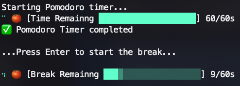
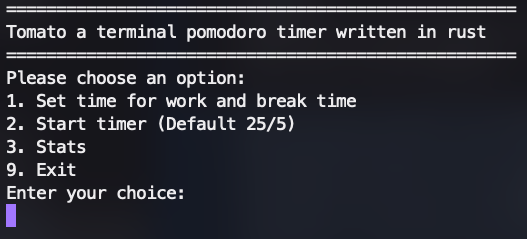

# Tomato

Tomato is rust based pomodoro timer that lives in your terminal.

Right now you can edit the default work and break time to your liking. The default is 25/5. You can start the timer and you have a visual indication of how much time has passed. You can see how many minutes and seconds are left in the current session. You can see how many minutes you have worked this session. It also plays a sound when the work and break timers are done.

## Usage

Tomato works both as a TUI app, as well as being 100% functional using only CLI arguments. The arguments are:
* `tomato run`: Starts 1 cycle with the specified work/break ratio (default 25/5).
* `tomato run --work xx --break yy`: Starts 1 cycle with the specified work/break ratio. If only one work or break has been supplied, uses default.
* `tomato set-defaults`: Changes the default work/break ratio.
* `tomato stats`: Shows you the statistics of your sessions.

See more in `tomato --help`.

## Future imporvements
- Better terminal UI

### Timer

### Menu

